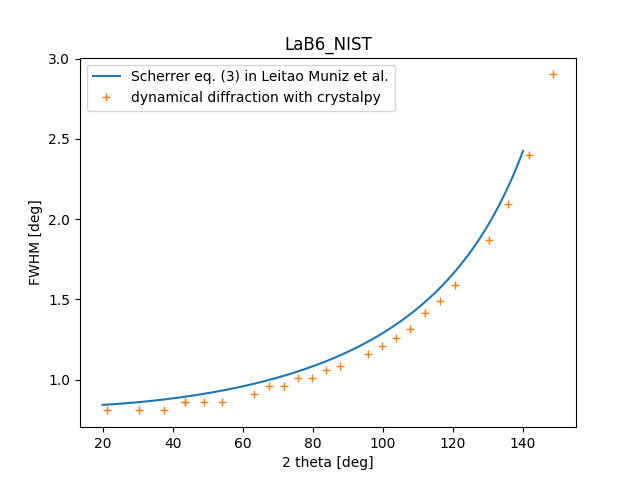
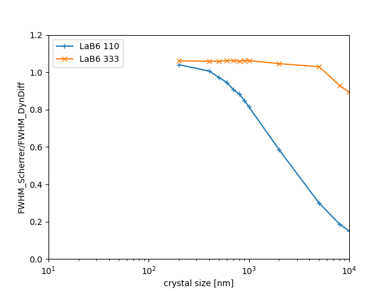
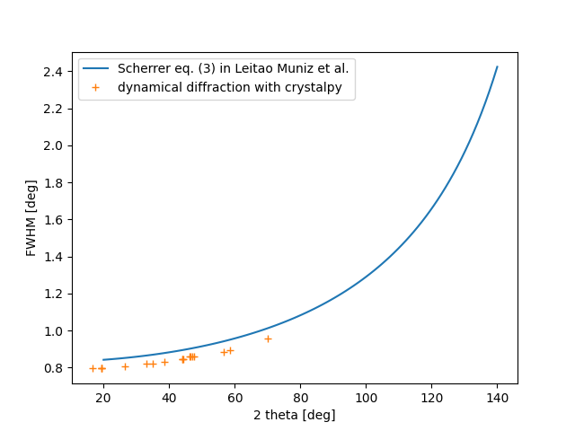
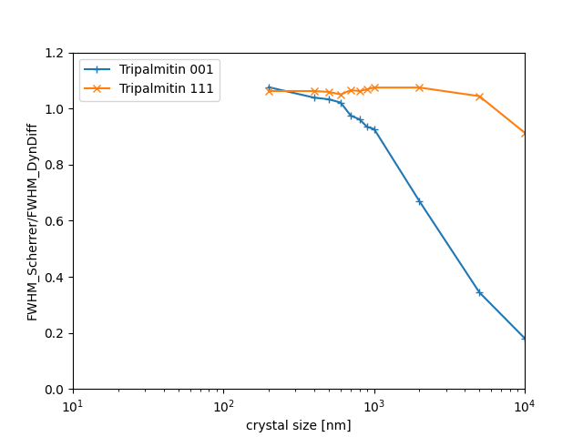

==============================================================
Test of test Scherrer equation vs dynamical diffracion results
==============================================================

The dynamical diffraction profile is calculated for several cases of hkl reflections and crystal thickness, and
the results are compared with the Scherrer equation for two crystals LaB6 and Tripalmitin.

----
LaB6
----

For LaB6 the results are calculated using the scripts:

- scherrer_LaB6.py : comparison as a function of 2theta.

- scherrer_vs_xtal_thickness_LaB6.py : comparison vs crystal thickness.

-----------
Tripalmitin
-----------

Tripalmitin crystal is not available in the standard crystalpy material libraries (xraylib and dabax).
To include it, a new entry has been created in the dabax data file ./dabax/Crystals.dat, that is used for calculations
in the scripts

- scherrer_Tripalmitin.py : comparison as a function of 2theta.

- scherrer_vs_xtal_thickness_tripalmitin.py : comparison vs crystal thickness.

This new entry in dabax has been created:

- using the cif file from: https://www.ccdc.cam.ac.uk/structures/Search?Compound=tripalmitin&DatabaseToSearch=Published

- calculating the 1x1x1 supercell using cif2cell (files here: https://github.com/srio/shadow3-scripts/tree/master/cif131755 )

- copying this structure to Crystals.dat

The selected [intense] reflections are obtained making a powder diffraction simulation runing oasys/powder with the cif
file (files: https://github.com/srio/shadow3-scripts/tree/master/cif131755 ).

